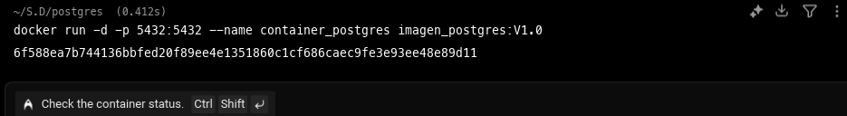

# postgres_docker

# Taller: Bases de Datos con Docker

**Nombre:** Julian Bayona  
**Código:** 202120055  
**Taller:** Bases de datos docker

## Descripción

Este proyecto implementa una base de datos containerizada utilizando Docker, con configuración automatizada de variables de entorno, scripts de inicialización y exposición de puertos.

## Estructura del Proyecto

```
postgres-docker/
├── Dockerfile
├── images/
├── init-scripts/
│   └── init-postgres.sql
└── README.md
```

## Pasos de Implementación

### 1. Creación del Dockerfile

Crear un `Dockerfile` en el directorio específico con las siguientes características:
```bash
mkdir postgres
cd postgres/
touch Dockerfile
```

  ```bash
nano dockerfile
```
- Definición de variables de entorno
- Script de inicialización que se ejecuta al levantar el contenedor por primera vez
- Exposición de puerto definido


### 2. Script de Inicialización

Crear el archivo de inicialización en la carpeta especificada en el Dockerfile que contendrá:


```bash
mkdir init-scripts
cd init-scripts/
touch init-postgres.sql
```

- **DDL** (Data Definition Language): Estructura de la base de datos
- **DML** (Data Manipulation Language): Datos iniciales

```bash
nano init-postgres.sql
```


### 3. Construcción de la Imagen

Ejecutar el comando para crear la imagen Docker:

```bash
docker build -t image-postgres:v1.0 .
```


### 4. Verificación de la Imagen

Listar las imágenes disponibles para confirmar que se creó correctamente:

```bash
docker images
```


### 5. Ejecución del Contenedor

Arrancar el contenedor con la configuración necesaria:

```bash
docker run -d -p 5432:5432 --name container-postgres  image-postgres:v1.0
```

### 6. Verificación del Estado

Comprobar que el contenedor esté ejecutándose correctamente:

```bash
docker ps
```


### 7. Conexión y Pruebas

Conectarse al contenedor y verificar:
- Existencia de las tablas creadas
- Presencia de los datos iniciales insertados

```bash
docker exec -it container-postgres psql -U julian -d mi_db 
```


## Variables de Entorno

Las siguientes variables de entorno son configuradas automáticamente:
- `POSTGRES_DB`: nombre de la base de datos
- `POSTGRES_USER`: nombre del usuario
- `POSTGRES_PASSWORD`: contraseña del usuario

## Requisitos

- Docker instalado y configurado
- Permisos de ejecución para Docker

## Uso

1. Clonar o descargar el proyecto
2. Navegar al directorio del proyecto
3. Seguir los pasos de implementación listados arriba

## Notas

- El script de inicialización se ejecuta únicamente la primera vez que se levanta el contenedor
- Las variables de entorno están predefinidas en el Dockerfile
- El puerto está expuesto según la configuración establecida

## Autor

Julian Bayona - Código: 202120055
